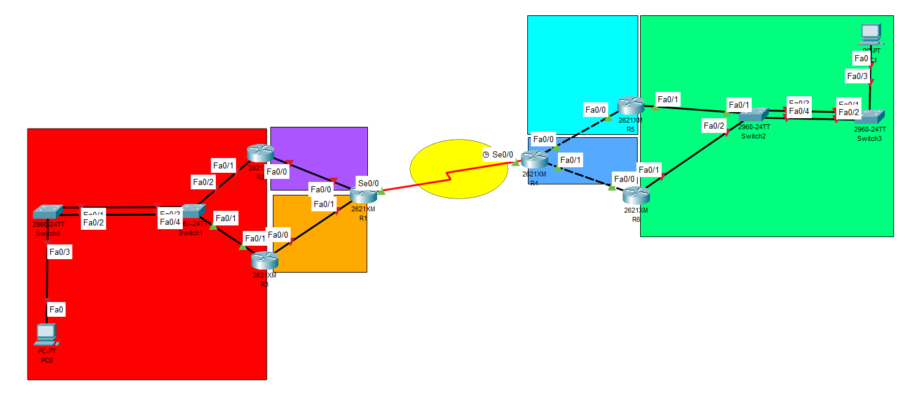
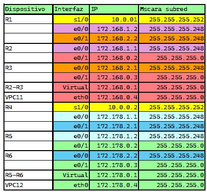
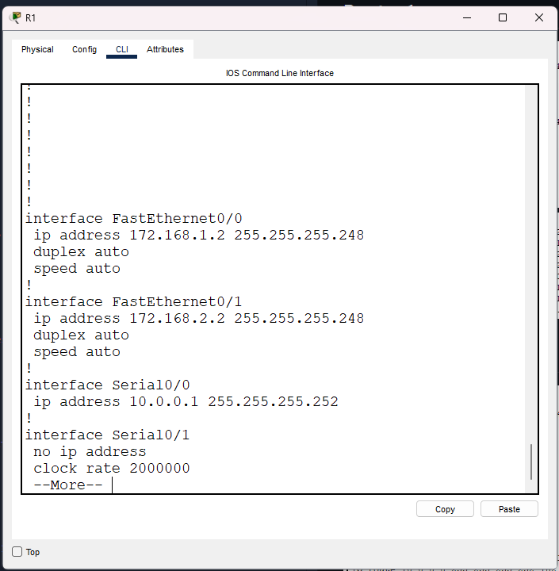
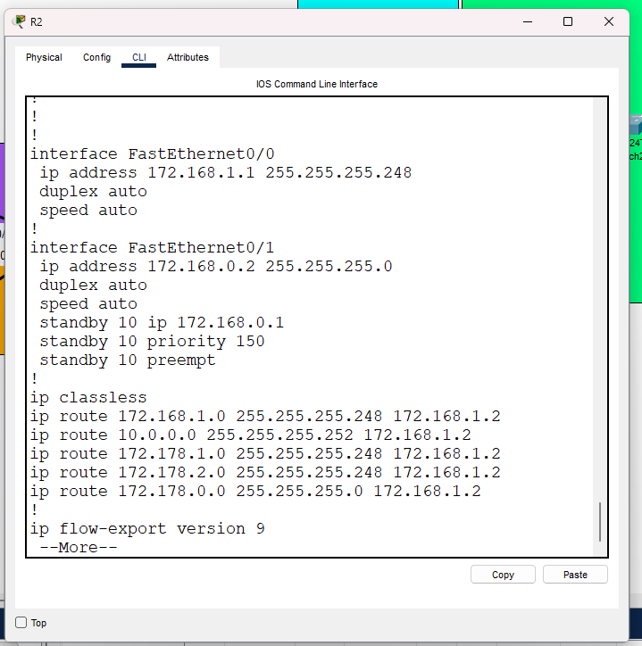
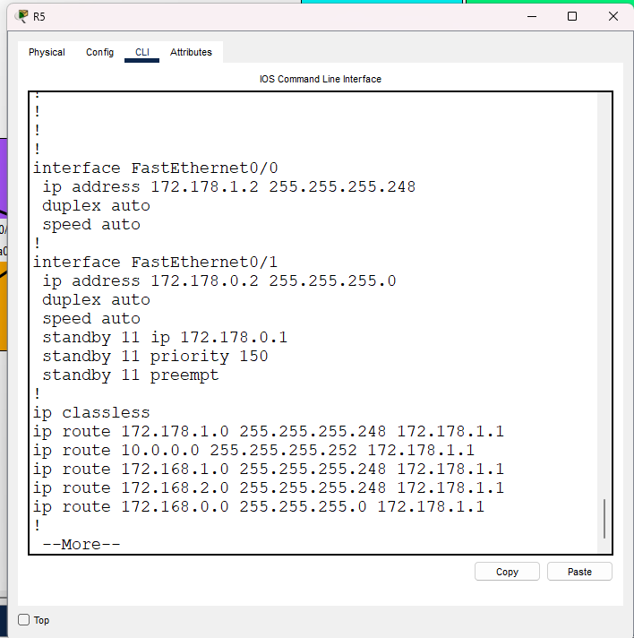
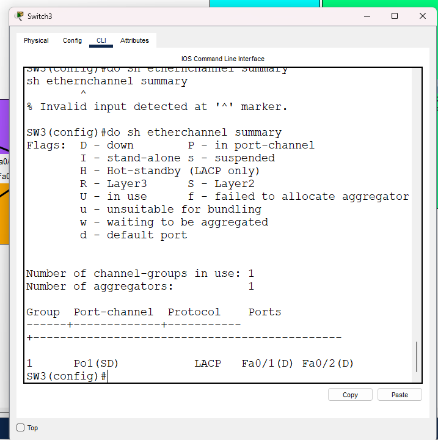
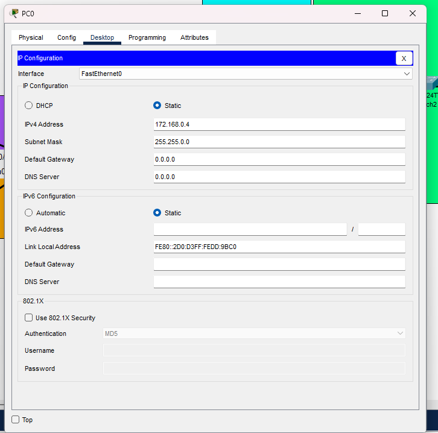

# **Práctica 2**

## **Manual Técnico📚**


### **0. Topología de Red📡**


<div align="center"></div>


### **1. Configruacion de Ips📡**
```
 1X2.168.1.2
```
<div align="center"></div>

Donde:
```
x : Es mi ultimo digito del carné.
```
### **2. Router 1📡**
<div align="center"></div>


### **3. Router 2📡**
<div align="center"></div>


### **4. Router 5📡**
<div align="center"></div>


### **5. Switch 3📡**
<div align="center"></div>


### **6. VPC11📡**

<div align="center"></div>


## **Resumen de Comandos📚**

#### **Configuracion Router 3📡**
```
enable
conf t
hostname R3

int f0/0
ip address 172.168.2.1 255.255.255.248
no shutdown
do wr
exit

int f0/1
ip address 172.168.0.3 255.255.255.0  
no shutdown
do wr
exit

```


#### **Configuracion Router 3 Ip Virtual📡**
```
enable 

conf t
int f0/1
standby 10 ip 172.168.0.1 
standby 10 priority 150 
standby 10 preempt
no shut
do wr
exit

do sh run 

```


#### **Configuracion Switch 0📡**
```
enable 

enable
conf t
hostname SW1
no ip domain-lookup
do wr 

int range f0/1-2
channel-protocol pagp
channel-group 1 mode desirable
do wr
exit
do sh etherchannel summary
```

#### **Configuracion Ip Estatica en Router 2📡**
```
ip route 172.168.1.0 255.255.255.248 172.168.1.2 
ip route 10.0.0.0 255.255.255.252 172.168.1.2 
ip route 172.178.1.0 255.255.255.248 172.168.1.2 
ip route 172.178.2.0 255.255.255.248 172.168.1.2 
ip route 172.178.0.0 255.255.255.0 172.168.1.2
```

## **Comandos de Verificacion📚**

#### **Comando para verificar en los Switches📡**

```
do sh etherchannel summary
```

#### **Comando para verificar en los Routers📡**

```
do sh run
```